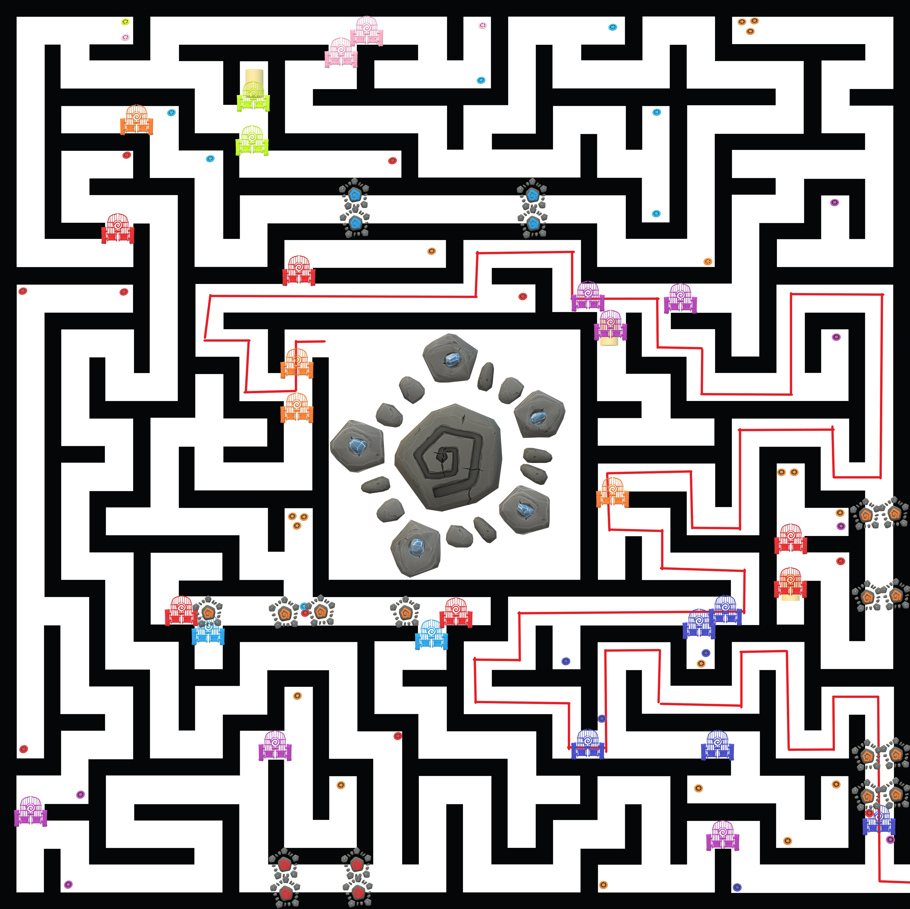

# EternalTempleMaze

# Tips
The Box on your left hand sphere in the wrist area is a hard Reset Button use it when you're stuck.

Not all gates stay open. Theres a lot of 50/50s and guesses youre gonna have to make which may result in the maze being uncompletable so youll have to reset.

All gates take one gem to open and all teleporters take 3 gems to use. Teleporters only go one way so youll need to activate another teleporter to go back the same way. Gems always get destroyed when used.

# Design Process

I recently purchased a humble bundle containing some really high quality art assets for unity one of those assets was called eternal temple. They contained a lot of pieces I could easily snap to together. I also used a free skybox asset I found and music from another asset in the bundle. I was considering how to implement teleportation and I came to the conclusion that I should create a teleportation pad that could be activated by placing special items on top of it. I was pretty successful in implementing a lot of my ideas but many things had to be scaled down or removed. For example, I originally wanted my maze to be full of traps and also had ideas for the player to have a weapon that could attack mobs in the maze. The makings for these ideas such as assets and fractions of code are there but in the essence of time i had to make decisions on what to add right now. My most challenging obstacles were mapping out the maze and making sure all the floors and walls were closed off and where they were supposed to be. ProGrids was really helpful for me in overcoming this challenge but there was also just a lot of play testing that had to be done and still has to be done. I also had a difficult time trying to work with the input system which is why the reset button is an interactable object attached to the player and a input from the controller.

# Game Files

Heres a Link to the Zip for the Game Files. Im not sure how to upload them another way since this is the first time i had a file this big.
https://drive.google.com/file/d/1J3-Ox-ZRv2YiSvUyypWM9EBkwB_w13sm/view?usp=sharing

# Videos

Video 1: Gates And Grabbables   
https://drive.google.com/file/d/1_QJAVJmMIKqe8RrkNSBzSAghdDH5DSo7/view?usp=sharing

Video 2: Teleporter Activation  
https://drive.google.com/file/d/1Z8A2OXnN-fZww6VADIMmmip8hQcBa03s/view?usp=sharing

Video 3: Win Condition & End Scene  
https://drive.google.com/file/d/14LzuuEkqIVe1_E_s78FMaHhDufXQb9h3/view?usp=sharing

# Assets

Fantasy Skybox Free
https://assetstore.unity.com/packages/2d/textures-materials/sky/fantasy-skybox-free-18353

Sets - Gems
https://assetstore.unity.com/packages/3d/props/sets-gems-19902

Total Music Collection
https://assetstore.unity.com/packages/audio/music/orchestral/total-music-collection-89126

Eternal Temple
https://assetstore.unity.com/packages/3d/environments/fantasy/eternal-temple-65780

# Maze BluePrint
(All gates, gems, teleporters, deadends, and the final exit portal in one graphic)

